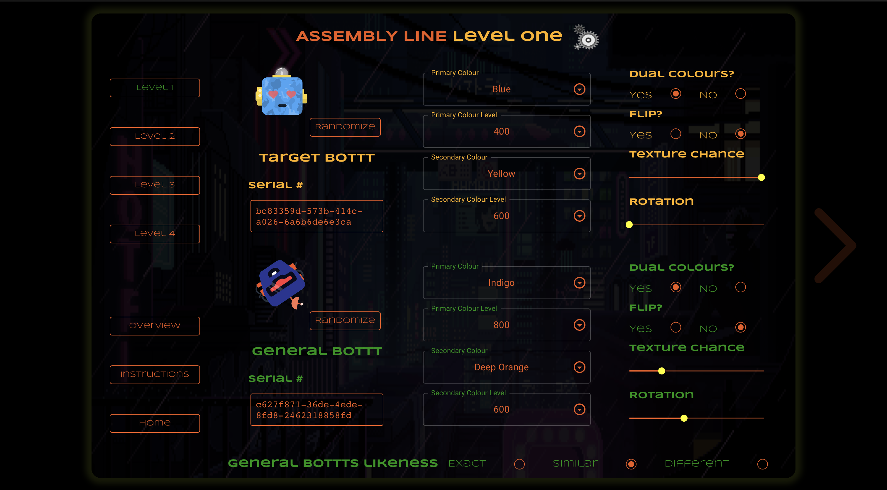
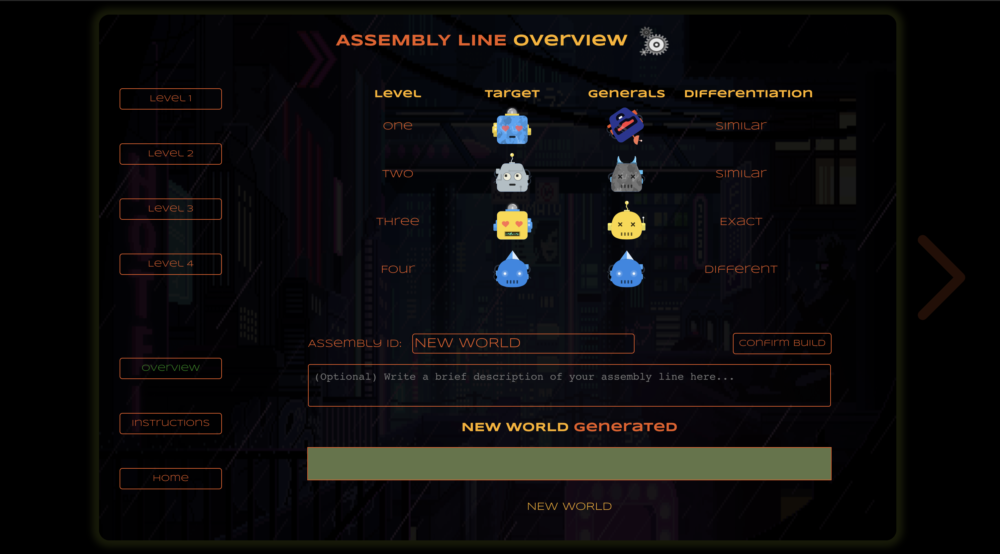
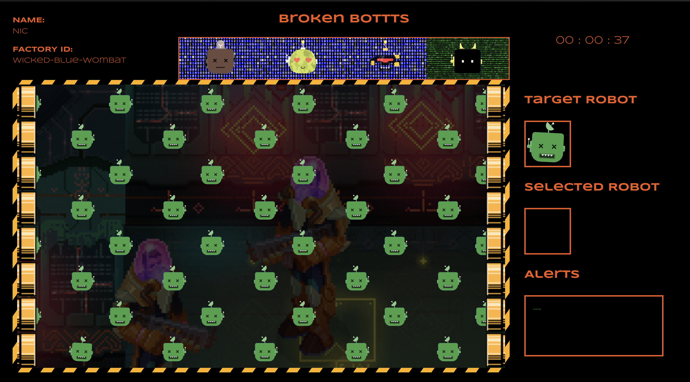

# Broken Bottts

Hello and welcome to Broken Bottts the game. The objective is similar to Where's Waldo. While being timed, the player 
must to find the target robot amongst other robots to proceed to the next level for a total of 4 levels. After their game the score will be posted to the leaderboards if they make the top 5. Each game can be customized by players by choosing how the robots look. These custom games can be set as seeds for anyone else who plays to enjoy.

Note: This game was built and meant to be played on devices with dimensions of 3024-by-1964 and no smaller. It can also be played on larger devices as well but was not optimized to do so.

Custom level creator: Level 1



Custom level creator: Overview



Playthrough: Level 4



## Tech Stack

- react: 17.0.2
- sass: 1.49.9
- @dicebear/avatars: 4.10.2
- @dicebear/avatars-bottts-sprites: 4.10.2
- @emotion/react: 11.8.2
- @emotion/styled: 11.8.1
- @mui/icons-material: 5.5.1
- @mui/material: 5.5.3
- @mui/system": 5.5.3
- axios: 0.26.1
- dotenv: 16.0.0
- lodash: 4.17.21
- unique-names-generator: 4.7.1
- uuid: 8.3.2


## Installation

Install broken-bottts and its dependencies with npm

```bash
  cd broken-bottts
  npm install broken-bottts
```

Create and add enviornment variables to .env file.   
Note: Using your own version of the game requires using your own server and database.
Please see [Broken-Bottts-API](https://github.com/NickCascella/broken-bottts-api) to create your own.

```bash
  REACT_APP_URL = YOUR OWN SERVER WITH DATABASE
```
    
Start game
```bash
  npm start
```

## Authors

- [@NickCascella](https://www.github.com/NickCascella)

